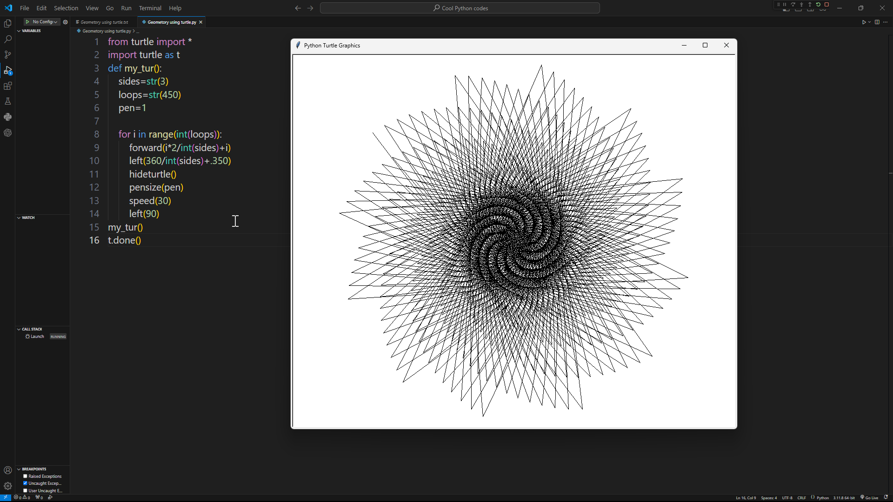

# 1 Geometry using turtle

# 2 Tracking phone number loacaion using geocoder

# 3 Parallel execution using threads.
# 4 Alaram clock
# 5 Random password generator
# 6 Bruteforce method to find input text
# 7 QR code generator
# 8 signature code
# 9 find all netword connected to a pc (wifi name & password)

